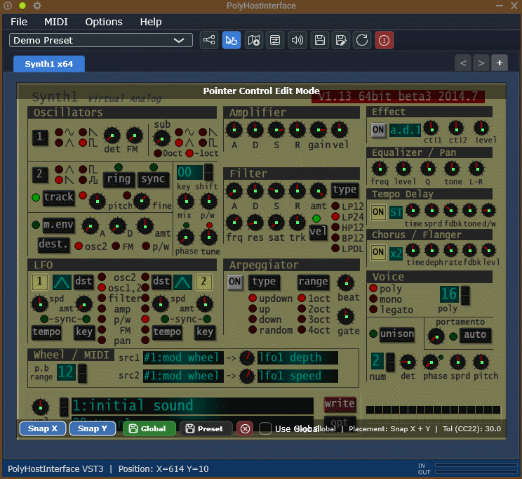
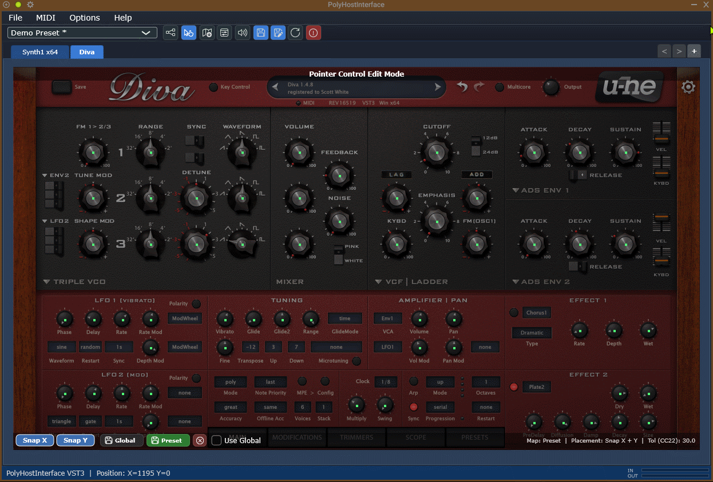
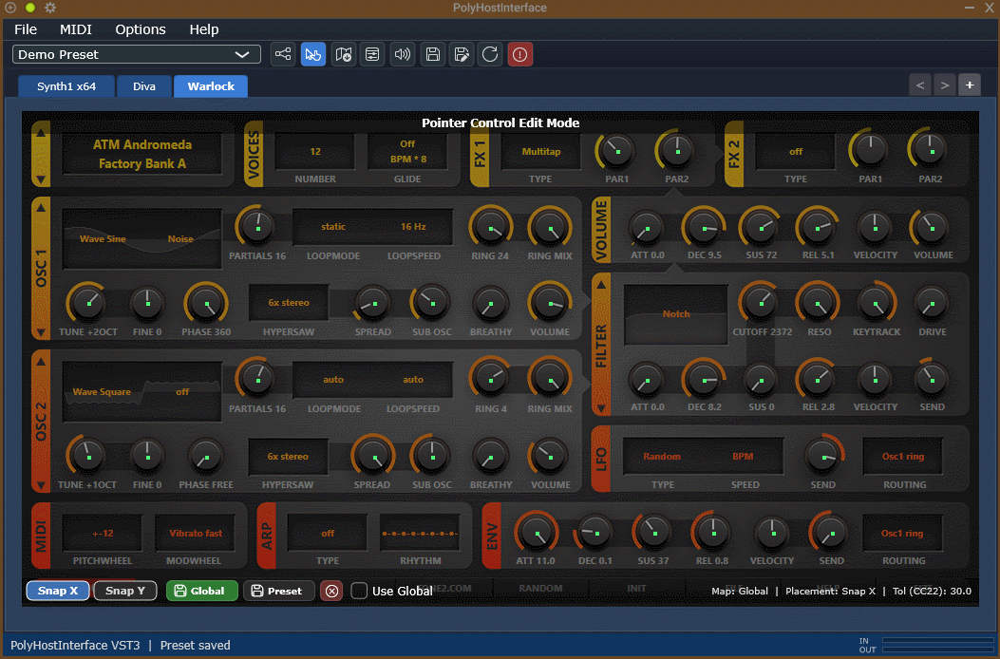

# Poly Host Interface

A lightweight, standalone tabbed VST2, VST3, (CLAP - Later when JUCE 9 released) plugin host for Windows.
Play synths and route FX chains, driven by any MIDI device.
Fully portable: stores all settings next to the exe/vst3, touches nothing else on the system.

I always liked tools like TobyBear's MiniHost, SaviHost and Tone2's NanoHost. But wanted something that combines all of them. A quick jamming tool that can open multiple plugin formats. I aim to add support for more formats. This is a tool that doesn't yet exist elsewhere in a small package like this, at least not as one that you can use file-associations with.

The standalone version is an expanded version of the VST3 plugin code, adding features not required by a plugin. This makes it easier to maintain and keep functionality/preset compatibility consistent.

See the demos at the bottom of the page for a few gifs of the Pointer Control in action...

## Feature Status

| Feature | Status - Some features only in APP or VST3 |
|---|---|
| VST2 **32-bit** in 64-bit host | 🔴 Needs plugin bridge — see below - planned |
| VST2 x64 | ✅ Working - Requires Steinberg VST2 SDK to build — see below |
| VST3 x64 | ✅ Working - Full support for Shell VST's|
| CLAP x64 | ✅ Once JUCE natively supports CLAP, then it will be added to PHI |
| MIDI 1.0 | ✅ Working |
| MIDI 2.0 (Windows MIDI Services) | ⚠️ Requires JUCE 8+ and Windows 11 - planned |
| Tabbed interface (Synth: parallel + FX: serial) | ✅ Working |
| Tab-ordering = FX routing order | ✅ Working |
| Portable settings (no AppData/registry) | ✅ Working |
| Audio / MIDI recording | 🔲 Planned for standalone |
| Pointer Control functionality | ✅ Working - Absolute knob mode (1) and 3x Relative knob modes (2),(3) and (4) |
| Mouse button emulation | ✅ Working - (Left, Middle, Right buttons) |
| Keyboard emulation | ✅ Working - (Limited to: Up, Down, Enter, mainly for menu navigation) |
| MIDI Monitor | ✅ Working |
| MIDI Macros | ✅ Working |
| Plugin Repair - locates missing plugins | ✅ Working |
| Standalone App | ✅ Working |
| VST3 Plugin for use in other hosts | ✅ Working |

## Features

### Tabbed Plugin Hosting
PolyHostInterface hosts multiple plugins in a tabbed workflow, allowing quick switching between synth and FX tabs inside one container plugin.

### Routing View
The Routing View provides a structured overview of all tabs in the current preset, including:
- tab order
- synth / FX type
- bypass state
- solo state
- MIDI assignment count
- per-tab pointer adjust mode override
- detailed plugin info report

Tabs can be reordered, soloed, bypassed, and selected directly from this view.

### Routing View Explained
- Click the Synth/FX labels to close routing view and open the tab for that row. Next to which is the plugin name.
- Adjust Method is used for setting the PointerControl mode. Global uses the setting specified in the PointerControlSettings panel. Drag sets only this tab/plugin to use drag method of adjustment. Scroll sets it to use mouse scroll as adjustment type. Setting this to Drag or Scroll allows a global setting to be used for every other tab/plugin, while allowing you to set specific setting per tab for independant plugin control. Then, in practise, usage is pretty seemless and invisible.
- The MIDI buttons are used to designate the MIDI channel used for that plugin tab. ie, you may want to designate a keyboard to the synths, but have a MIDI controller to adjust FX so you may need to specify channel per device for each plugin.
- The Green buttons are used to enable/disable the audio/MIDI for that tab/plugin so effectively making it a bypass/mute function.
- Then comes the 'S' button, used to Solo each plugin tab. You can Solo any number of tabs. Bypass/Mute states are restored when the last Solo button is deactivated.
- The next two buttons are the Up/Down arrows and are used to adjust the position in the chain so you can set up different chains for the same plugins, thereby saving different presets with different chains for different situations.
- The next button is an info button, used more as a tooltip, but click it to see detailed plugin info. On hovering this button, it will show info about what FX a synth is outputting its audio to or which Synths an FX is receiving input from.
- The last button is a Close Tab button to allow closing tabs from the routing view.

### Soloing
Soloing temporarily isolates one or more tabs by muting all non-soloed tabs.

Behaviour:
- soloed tabs remain audible
- non-soloed tabs are bypassed while solo is active
- multiple tabs can be soloed at once
- clearing solo restores the normal manual bypass states

This is useful for quickly auditioning individual synths or FX chains in a larger preset.

### Macro Mapping
PolyHostInterface includes 128 host-visible macro controls.

These macros can be mapped to plugin parameters so they can be automated from the DAW without needing to expose the hosted plugin's own automation directly.

Macro features include:
- map the last touched plugin parameter to the next free macro
- replace an existing macro target with the last touched parameter
- reorder mappings
- delete individual mappings
- clear all mappings
- undo the last macro mapping edit
- filter/search mappings in the Macro Mappings view

Each mapping stores:
- macro slot number
- source tab
- plugin name
- parameter name
- parameter index

Please note: Only use the Macros 001-128, ignore the MIDI CC 0|129 etc as these are for Host side control but I couldnt find a way to hide them.

### Macro Mappings View
This provides a complete list of all current macro assignments in the preset.

It allows:
- browsing all active mappings
- filtering by macro, tab, plugin, or parameter
- reordering mappings
- replacing targets
- deleting mappings
- clearing all mappings
- Undo allows undoing the last action only

### Pointer Control
The Pointer Control system is designed for a much speedier programming of any plugin using just a small handful of knobs and buttons on your MIDI controller, instead of assigning one knob/button per parameter. This means you spend less time assigning knobs to parameters. For synth programmers, this is likely far quicker than traditional methods.

It allows MIDI-driven control of the mouse cursor over the currently selected hosted plugin editor. This function allows using only three hardware knobs to control all parameters that work via a scroll or drag operation via emulation of mouse actions. Much easier and quicker than traditional MIDI mapping as it allows using the mouse, or assigning knobs for cursor X/Y psoition, to move the cursor while using a single knob to adjust whatever is under the cursor. Much better than using the scroll wheel or dragging parameters with the mouse!

This includes:
- X/Y pointer movement by MIDI CC
- X/Y lane tolerance control
- Use Mouse Back/Forward buttons to toggle Snap X and Y
- wheel or drag-style parameter adjustment
- Mouse button and keyboard emulation for menu navigation
- 'adjust' sensitivity control
- optional point snapping
- create multiple editable jump-point maps per plugin tab

### Pointer Edit Overlay
Pointer Edit Mode displays an overlay over the hosted plugin editor so jump points can be created, previewed, removed, and visually aligned.

The overlay supports:
- live point placement
- optional X snap (Snaps to other points along X axis)
- optional Y snap (Snaps to other points along Y axis)
- preview point display before release
- optional crosshair display
- per-tab lane tolerance feedback
- map source indication
- right click and drag to set a rectangular area where snapping is disabled:
  - Up to 8 pointer free zones per tab.
  - Right-drag adds a new rectangle.
  - Existing rectangles stay in place.
  - Overlapping rectangles are allowed.
  - Right-click inside a rectangle removes one rectangle.
  - If rectangles overlap, deletion removes the smallest rectangle under the cursor.
  - If overlapping rectangles are the same size, deletion removes the newest one.
  - Bottom bar shows: Free Zones: N


> [!NOTE]
> **Implementation Note: Pointer Edit Overlay**
>
> The pointer edit overlay is implemented as a plain `juce::Component` added to the desktop with `addToDesktop(...)`, rather than using `DocumentWindow`, `CallOutBox`, or `PopupMenu`.
>
> This allows the overlay to:
> - appear correctly over hosted plugin editors
> - match the hosted editor bounds exactly
> - avoid title bar chrome and popup layout constraints
> - refresh dynamically when switching tabs
>
> - NOTE: It can reside over other windows too, which is an unfortunate consequence

### Pointer Maps
Pointer jump-point maps are stored in the PointerMaps directory and are accessed via the combobox in the top right of the window. If a map for the currently selected plugin tab is detected, it will be shown here. If there are multiplt maps for a plugin, all will be shown here and are selectable via the combobox or via your mouse's Back/Forward buttons. This last function is dependant on the Pointer Editor Overlay NOT being active. If the Overlay is active, these buttons toggle snapping of X/Y.

A pointer map is saved per plugin and can be reused across presets. It saves having to recreate the same map for every instance of a plugin.

Use this when:
- the same plugin layout is used repeatedly
- you want one reusable default map for a plugin

NOTE: As maps are saved to a separate dedicated file as XML, they are also shareable online! So if this becomes popular enough, you may find maps available online. But I will eventually upload all of my own maps here when done, making it easier to get started.

#### Additional Pointer Maps
A different pointer map may be required for differetn skins of the same plugin, so you are free to select whichever is most suitable. Useful for plugins that have different ways of setting it up (Diva) or different skins that rearrange a plugins layout.

Use this when:
- a plugin needs its own custom point layout for each skin/theme/layout
- a plugin has several tabs/pages, eg: Osc, Filter, LFO, etc...

You are free to store maps in subfolders within the PointerMaps directory allowing for better organisation. As long as Maps are stored in that folder, they will be detected and shown in the combobox with all subfolders being searched recursively for any map files.

### MIDI Assignment Per Tab
Each tab can maintain its own MIDI channel assignment set, allowing different hosted plugins to respond to different incoming MIDI sources/channels.

### Preset Handling
PolyHostInterface supports:
- creating presets
- saving presets
- saving presets as new files
- loading presets
- recent preset history
- preset dirty-state tracking
- preset deletion
- plugin path recovery for missing plugins

### Missing Plugin Repair
If a plugin cannot be found when loading a preset, PolyHostInterface can prompt you to locate the replacement file and restore the tab. Tabs will turn red to display there is an error with loading the plugin. Routing View will also turn a row red as a visual clue as well.

### MIDI Monitor
A built-in MIDI monitor can be used to inspect incoming MIDI events, including:
- notes
- CC
- pitch bend
- aftertouch
- system messages
- clock / active sensing filtering
- filter specific events

Pause / Freeze works like this:
- Pause:
  - stops capture.
  - incoming monitor events are discarded while paused.
  
- Freeze:
  - keeps capturing internally.
  - visible table stops updating/scrolling.
  - unfreezing refreshes the table with the captured rows.

Copy/export behaviour:
- Copy Row:
  - copies selected visible row as tab-separated text.

- Copy All:
  - copies all currently visible rows as tab-separated text.

- Export:
  - exports currently visible rows to .csv or .txt.

- Raw Hex:
  - shows raw MIDI bytes, for example:
  - B0 07 64
  - E0 00 40
  - F0 7E 7F 09 01 F7

## Project Folder Structure

```
_Projects\PolyHost\              ← your project root
│
├── build-APP/VST3.bat           ← THE build script (run this)
├── README.md
│
│
├── Source\
│   ├── APP\
│	│	├── CMakeLists.txt
│   │	└── Standalone Source files here...
│   └── VST3\
│		├── CMakeLists.txt
│   	└── VST3 Plugin Source files here...
│
│
├── dist\                        ← build output — PolyHost.exe/PolyHost VST3 lands here
└── [PolyHost.exe/.vst3]\
    └── Settings\                ← created at runtime, settings stored here
        └── polyhost.xml


_Projects\_Tools\
    ├── cmake\                   ← extract cmake-4.3.1-windows-x86_64.zip HERE
    │   └── bin\
    │       └── cmake.exe
    │
    ├── vstsdk2.4\      		 ← drop your VST2.4 SDK here
    │   └── pluginterfaces\
    │       └── vst2.x\
    │           └── aeffect.h    ← CMake checks for this file
 	│
 	└── clap\					 ← drop your CLAP SDK here
 	   	└── CMakeLists.txt
 
 
```

## Build Setup (one-time)
Setup Steps for You
One-time installs (unavoidable for C++)

    Visual Studio 2026 Community — free: https://visualstudio.microsoft.com/vs/community/
        During install tick: Desktop development with C++

Portable tools (no installer, just extract)

    Go to https://cmake.org/download/
    Find "Windows x64 ZIP" (e.g. cmake-4.3.1.x-windows-x86_64.zip)
    Extract it so the structure is:
    Projects\_Tools\cmake\bin\cmake.exe

### 1. Visual Studio 2022 Community (free)
https://visualstudio.microsoft.com/vs/community/
During install tick: Desktop development with C++
You never open Visual Studio. It only provides the C++ compiler that CMake calls.
But this way allows you to use whatever editor you want.

### 2. Portable CMake (no installer)
Download the Windows x64 ZIP from: https://cmake.org/download/
Extract so the result is: tools\cmake\bin\cmake.exe

### 3. Build
Double-click build.bat from the project root.
First run downloads JUCE automatically (needs internet).
After that, builds are fully offline.
The finished exe appears in dist\PolyHostInterface.exe

## Opening a Plugin
1. Right-click any vst2, vst3 or clap file in File Explorer
2. Open with > Choose another app
3. Browse to PolyHostInterface.exe
4. Tick "Always use this app" if you want it permanent
This means that anytime you then double-click a plugin in Explorer, it will auto-open into the first tab of PolyHostInterface, or add a new tab with that plguin if already open. So only one instance can be run at present.

## VST2 Support
If you have a copy of vstsdk2.4, place it here: {CMAKE_SOURCE_DIR}/tools/vstsdk2.4
then run build.bat.

## Audio/MIDI Routing
```
MIDI Device(s)    Audio In from DAW/Host
|					|
├── [Synth Tab 1] --+
├── [Synth Tab 2] --+  (summed)
|                   |
|              [FX Tab 1] (If Bypassed/Muted FX is ignored)
|                   |
├──----------- [FX Tab 2]
|                   |
└── [Synth Tab 3] --+  (only passes through FX below, bypasses any above)
                    |
              [FX Tab 3]
                    |
              [Audio Out]  ->  Output meter
```
MIDI is always wired in parallel. Synth and FX audio routing is partially flexible, where plugins are in series and routing can be modified by entering the Routing page. Click the Routing toolbar button and a list of all tabs appears, use Up and Down buttons to manage the processing order.

## Credits

Thanks to Stefan Matting and his [PointerCC](https://github.com/smatting/pointer-cc) app for the idea.


# Demos

These were made in [MuLab](https://www.mutools.com/index.html) DAW.
All cursor movements and parameter adjustments are made using Hardware MIDI controllers, not a real mouse.






